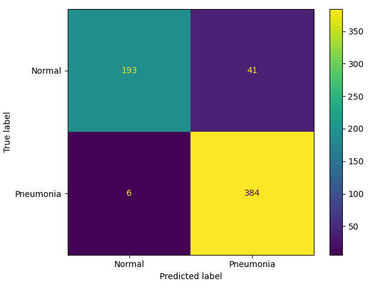

# Research-Project-in-Application-of-Artificial-Intelligence-on-Medical-Imaging-LAB1
The Lab1 of Research Project in Application of Artificial Intelligence on Medical Imaging. You can download and read description from [Kaggle: chest-xray-pneumonia](https://www.kaggle.com/datasets/paultimothymooney/chest-xray-pneumonia)

## Introdution

The dataset aim to detect PNEUMONIA by deep learning model, and limited to Resnet series model.


The best result of my experiments:



## Prerequisite

You should put training, validation and testing file from Kaggle as following expected structure:
```
.
├── archive.zip # the zip from Kaggle
├── best.pt
├── chest_xray # after unzip
├── custom_chest_xray_balance
├── dataloader.py
├── ExpRecord.csv
├── img
├── inference.py
├── InferenceResult
├── log
├── logger.py
├── main.py
├── README.md
├── requirements.txt
├── split_balanced.py
├── trainer.py
└── Untitled.ipynb
```

* install dependency:
    ```
    $ pip install -r requirements.txt
    ```

## Custom Train/Val

* The original dataset including only 8 normal and 8 defect images.
* If you want to running custom dataset which described in my report, run following command
* The script will move defect images from train to val folder.
    ```
    $ python3 split_balanced.py
    ```


## training

* please check paramter in main.py
* 
```
python3 main.py
```


## inference

I only upload best model since big file is not suitable uploading to Git.

```
$ python3 inference.py
```